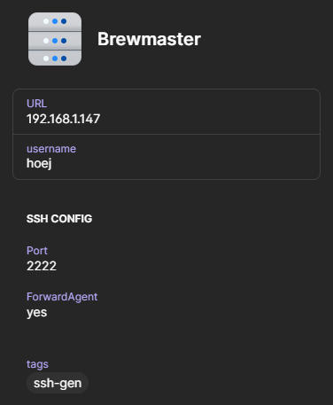

# 1Pasword utility for sshconfig

This utility is for generating a sshconfig you can `Include` in your main config from 'Server' items in your 1Password vault.

## Requirements

- [1Password CLI](https://1password.com/downloads/command-line/) (`op`). _Developed and tested with 2.9.1_.
- Have 1Password CLIC available in your PATH under the name `op`

## Usage

To use the application you first have to prepare some 'Server' items in your vault and then call the cli application.

### Vault items

To have Server items in your 1Password vault be put into the ssh config you have to add a tag to them, 
the utility will by default look for the tag `ssh-gen` but you can change that tag via the `--tag` argument to the application.

Furthermore, you can add a section called `SSH Config` (exact casing) to the Server item and it will take every field in there, perform basic validation on it
and add it to the generated config.


```
# Generated from sshconfig-1password on 2022-12-11T15:04:50+01:00 using sshconfig-1password version 0.0.0+N/A
Host brewmaster
        Hostname 192.168.1.147
        User hoej
        Port 2222
        ForwardAgent yes
```

### CLI 

When running the application you have to have the 1password cli `op` already authenticated, usually done with `eval $(op signin)` or if you have the option to have it authenticated via
the desktop application then just be sure it's logged in.

You can provide the following arguments on the commandline when generating your config:
```bash
Usage of sshconfig-1password:
  -out string
        Path of output file or stdout/stderr (default "stdout")
  -tag string
        Tag to lookup specific servers to add to the config (default "ssh-gen")
  -vault string
        Vault to fetch servers from
  -version
        Print current version
```

Once that is done, you simply take the generated file and use an `Include` directive in your main sshconfig file to 
include this generated file and you can start ssh'ing using the 'Server' items in your vault. Example:
```sh
sshconfig-1password -vault Personal -tag sshconfig -o 1pass.sshconfig
```

